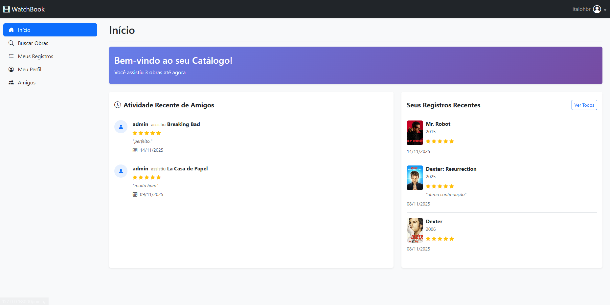
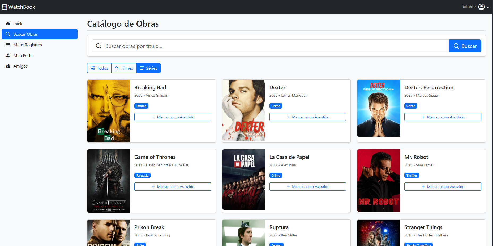
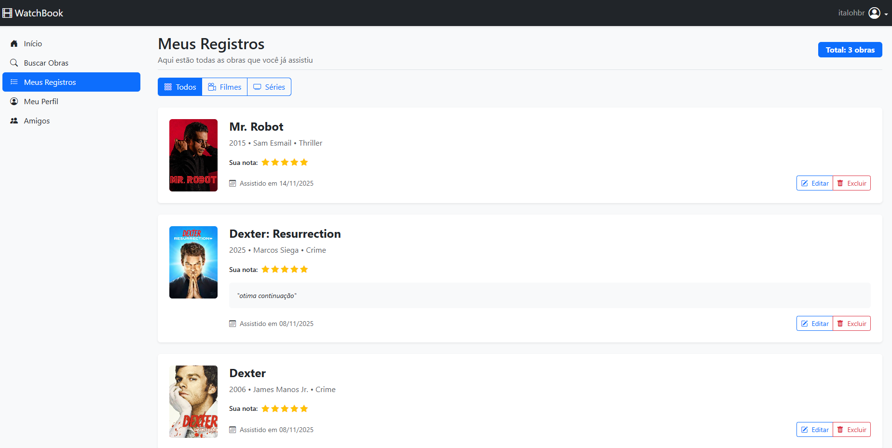
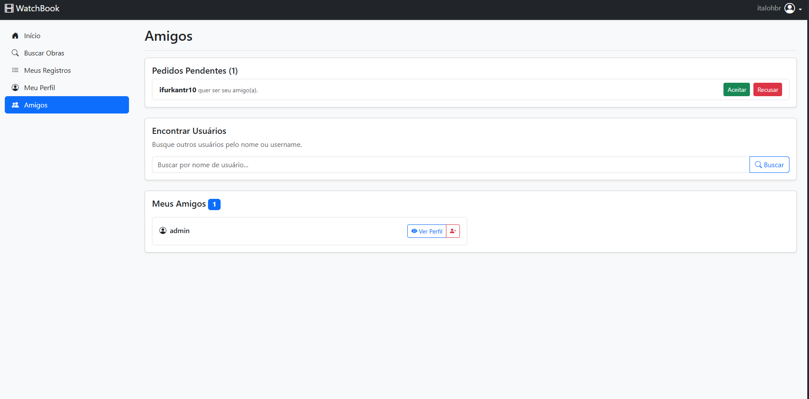
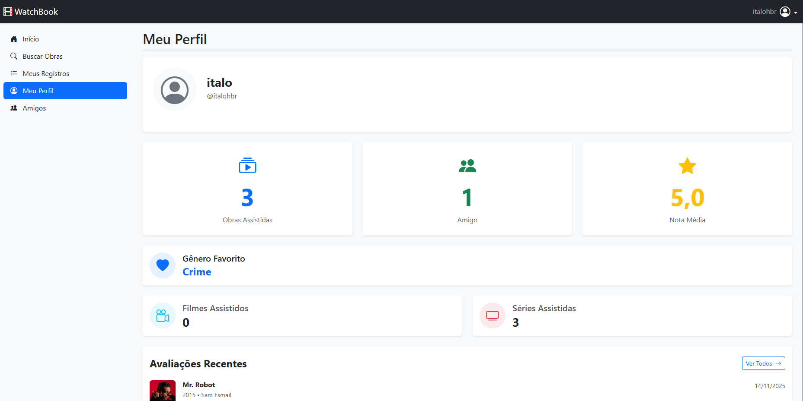
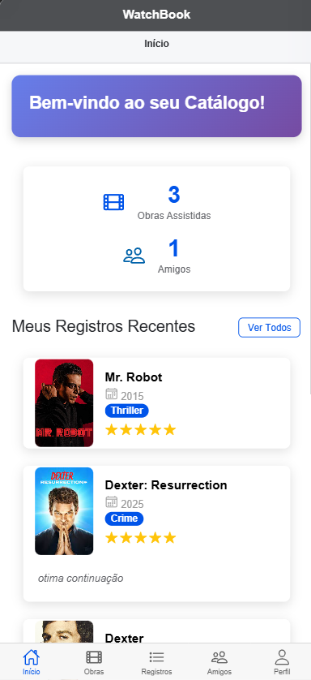
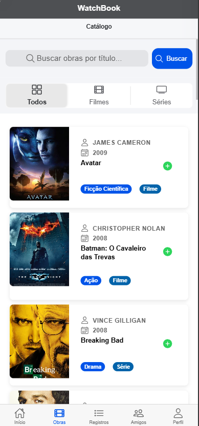
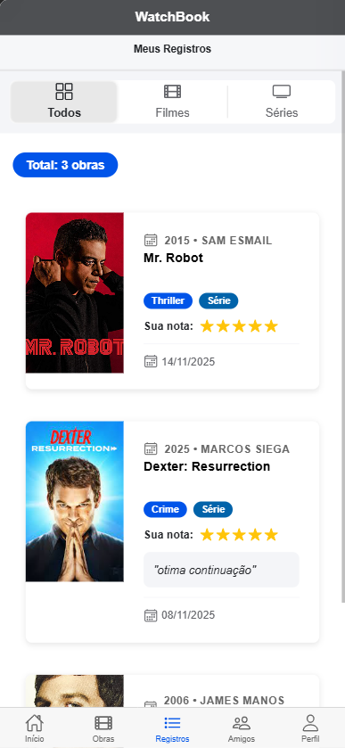
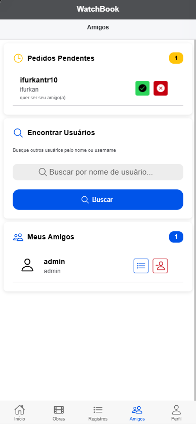
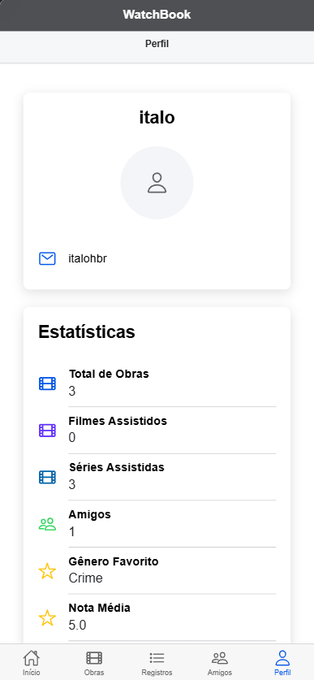

# 🎬 WatchBook

Catálogo pessoal de filmes e séries assistidos. Gerencie suas obras favoritas, avalie, escreva críticas e compartilhe com amigos.

## 📋 Sobre

Sistema completo para catalogar e acompanhar filmes e séries assistidos, com funcionalidades sociais para conectar-se com amigos e visualizar seus registros.

**Tecnologias:**
- Backend: Django + Django REST Framework
- Frontend Web: Django Templates + Bootstrap
- Mobile: Ionic + Angular + Capacitor

## 🚀 Início Rápido

### Backend (Django)

```bash
# Criar e ativar ambiente virtual
python -m venv virtual
source virtual/bin/activate  # Linux/Mac
# ou
virtual\Scripts\activate  # Windows

# Instalar dependências
cd watchbook
pip install -r requirements.txt

# Configurar banco de dados
python manage.py migrate

# Criar superusuário (opcional)
python manage.py createsuperuser

# Iniciar servidor
python manage.py runserver
```

**Acesse:** `http://127.0.0.1:8000`

### Mobile (Ionic)

```bash
cd watchbook-mobile

# Instalar dependências
npm install

# Iniciar servidor de desenvolvimento
ionic serve
```

**Acesse:** `http://localhost:8100`

## 📱 Funcionalidades

- **Autenticação** - Login, cadastro e logout de usuários
- **Catálogo** - Buscar e visualizar filmes e séries
- **Registros** - Marcar obras como assistidas com nota (estrelas) e crítica
- **Gerenciamento** - Editar e excluir registros pessoais
- **Filtros** - Visualizar registros por tipo (todos/filmes/séries)
- **Amizades** - Buscar, adicionar e gerenciar amigos
- **Social** - Aceitar/rejeitar convites e visualizar registros de amigos

**Disponível em:** Web (Django Templates) e Mobile (Ionic/Angular)

## 🖼️ Interface

### Versão Web

#### Início, Catálogo e Registros
<p align="center">
  
  
  
</p>

#### Amizades e Perfil
<p align="center">
  
  
</p>

---

### Versão Mobile

#### Navegação Principal
<p align="center">
  
  
  
</p>

#### Funcionalidades Sociais
<p align="center">
  
  
</p>

## 🔌 API Endpoints

### Autenticação
```
POST /api/login/          - Login (retorna token)
POST /api/logout/         - Logout
```

### Usuários
```
GET    /api/usuarios/              - Listar usuários
POST   /api/usuarios/              - Criar usuário
GET    /api/usuarios/{id}/         - Detalhe do usuário
GET    /api/usuarios/{id}/registros/ - Registros do usuário
```

### Catálogo
```
GET    /api/catalogo/              - Listar obras
GET    /api/catalogo/{id}/         - Detalhe da obra
GET    /api/catalogo/?tipo=filme   - Filtrar por tipo (filme/serie)
GET    /api/catalogo/?search=term  - Buscar obras
```

### Registros
```
GET    /api/registros/             - Meus registros
POST   /api/registros/             - Criar registro
GET    /api/registros/{id}/        - Detalhe do registro
PUT    /api/registros/{id}/        - Editar registro 
DELETE /api/registros/{id}/        - Deletar registro
```

### Amizades
```
GET    /api/amizades/              - Listar todas as minhas amizades
POST   /api/amizades/              - Enviar solicitação de amizade
GET    /api/amizades/{id}/         - Detalhe da amizade
DELETE /api/amizades/{id}/         - Remover amizade
POST   /api/amizades/{id}/aceitar/  - Aceitar solicitação
POST   /api/amizades/{id}/rejeitar/ - Rejeitar solicitação
GET    /api/amizades/pendentes/    - Solicitações pendentes (recebidas)
GET    /api/amizades/aceitas/      - Amizades aceitas
```

## 📂 Estrutura

```
watchbook-project/
├── watchbook/              # Backend Django
│   ├── catalogo/          # App de obras
│   ├── usuarios/          # App de usuários e registros
│   ├── amizade/           # App de amizades
│   ├── templates/         # Templates web
│   └── media/             # Uploads (posters)
│
├── watchbook-mobile/      # App mobile Ionic
│   └── src/
│       └── app/
│           ├── login/
│           ├── cadastro/
│           ├── catalogo/
│           ├── registros/
│           ├── amigos/
│           └── components/
│
└── virtual/               # Ambiente virtual Python
```

## 🛠️ Configuração

### Backend

Edite `watchbook/settings.py` para configurar:
- Banco de dados
- CORS (permitir mobile)
- Media files (posters)

### Mobile

Edite `watchbook-mobile/src/environments/environment.ts`:
```typescript
export const environment = {
  production: false,
  apiUrl: 'http://127.0.0.1:8000/api'
};
```

## 📦 Dependências Principais

**Backend:**
- Django 5.1.3
- djangorestframework
- django-cors-headers
- Pillow

**Mobile:**
- @ionic/angular
- @capacitor/core
- @ionic/storage-angular
